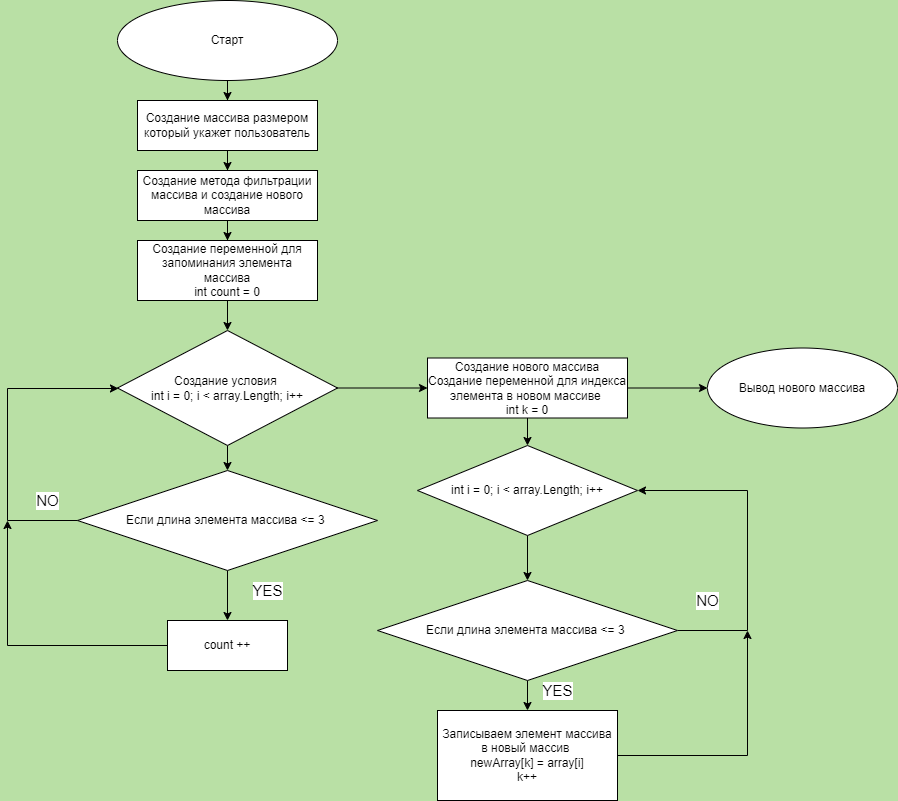

# Контрольная работа #
## Задача ##
    Написать программу, которая из имеющегося массива строк формирует массив из строк, длина которых меньше либо равна 3 символам. Первоначальный массив можно внести с клавиатуры, либо задать на старте выполнения алгоритма. При решении не рекомендуется пользоваться коллекциями, лучше обойтись исключительно массивами.

### Содержание ###
* [Составление алгоритма](#составление-алгоритма)
* [Составление блок схемы](#составление-блок-схемы)
* [Описание методов](#описание-методов)

_______

### Составление алгоритма ###
1. Определение размера массива строк
2. Создание нового массива
3. Определение строк у которых количество символов <=3
4. Наполнение нового массива
5. Вывод нового массива

_______

### Составление блок схемы ###

_______

### Описание методов ###

1. Метод заполнения массива пользователем 

Создается метод в котором будет создаваться и заполняться массив данными введенными пользователем. Создается цикл прохода по массиву с нулевого индекса. Пользователь задает значения элемента массива начиная с нулевого индекса и до тех пор пока индекс не будет меньше размера массива. 

        string[] FillArray(int size)
        {
            string[] array = new string[size];
            for (int i = 0; i < array.Length; i++)
                {
                    Console.Write($"Введите значения {i} индекса массива -> ");
                    array[i] = Console.ReadLine();
                }
            return array;
        }

2. Метод фильтрации и создания нового массива

Создаем метод для фильтрации массива по длине и записи элементов прошедших условие в новый массив. 
Определяем длину нового массива созданием цикла перебора массива. Создаем новою переменную *count* которая будет указывать на размер нового массива.

        string[] FilterArray(string[] array)
            int count = 0;
            for (int i = 0; i < array.Length; i++)
            {
                if (array[i].Length <= 3) count++;
            }
            
Далее создаем новый массив с использованием значения *count* и вводим новую переменную *k* которая будет обозначать индекс элемента в новом массиве. 

            string[] newArray = new string[count];
            int k = 0;
            for (int i = 0; i < array.Length; i++)

Заполняем новый массив использую условие.

                if (array[i].Length <= 3)
                {
                    newArray[k] = array[i];
                    k++;
                }

3. Метод вывода массива 

Создается метод для вывода массива в терминал. Создается цикл прохода по массиву начиная с нулевого индекса и выводом каждого элемента в терминал.

        void PrintArray(string[] array)
        {
            Console.Write("[");
            for (int i = 0; i < array.Length; i++)
            {
                if (i < array.Length - 1) Console.Write($"‟{array[i]}‟,");
                else Console.Write($"‟{array[i]}‟");
            }
            Console.Write("]");
        }

